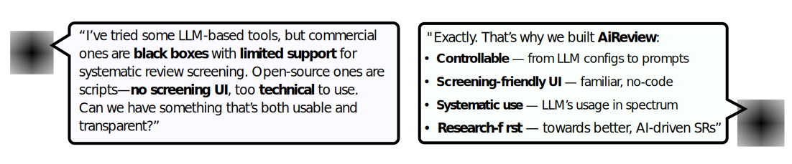
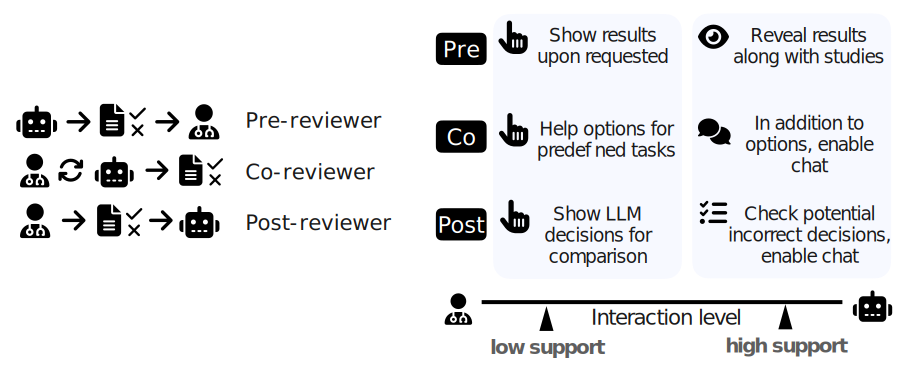

# AiReview: An Open Platform for Accelerating Systematic Reviews with LLMs


<p align="center">
| <a href="https://ielab.io/projects/systematic-reviews.html"><b>Project page</b></a> |
 <a href="https://arxiv.org/abs/2502.03400"><b>Demo Paper</b></a>  | <a href="https://aireview.ielab.io/"><b>Website</b></a> |
<a href="https://github.com/ielab/densereviewer"><b>Dense Reviewer</b></a>
</p>


<p align="center">
  
</p>

AiReview is a flexible, open platform for accelerating systematic reviews with large language models (LLMs). It enables researchers and librarians to LLM-assisted titles and abstract screening with three defined roles and seven pipelines composed of the roles, offering transparent, configurable, and interactive support for evidence-based screening tasks.

## Features
<p align="center">
  
</p>


- **Flexible LLM Integration**: Transpartent control over LLMs used, from configurations to prompts.
- **Three LLM Roles Framework**: 
  - **Pre-reviewer**: Scores studies before human review, aiding initial prioritization
  - **Co-reviewer**: Real-time assistance during human screening with SR Assistant
  - **Post-reviewer**: Quality control and decision validation after screening
- **Configurable Interaction Levels**: Choose between low-support (on-demand) and high-support (always visible) LLM assistance for bias control
- **Multiple Pipeline Modes**: Seven different LLM usage patterns from single-role (e.g. Pre-Only) to full assistance workflows


## Installation

#### Prerequisites:
 [Docker](https://docs.docker.com/get-started/get-docker/) and [Docker Compose](https://docs.docker.com/compose/)


### 1. Get the Code

```bash
git clone https://github.com/ielab/ai-review.git

cd ai-review
```


### 2. Launch AiReview
```bash
docker-compose build backend --no-cache --build-arg BUILD_OS=$(uname -s)

# start the app
docker compose up -d
```


## System Architecture

AiReview consists of two Docker containers: 

1. **Frontend**: Vue.js-based web interface with Tailwind CSS styling, served via Nginx. 
2.
2. **Backend**: Python-based back end with REST and WebSocket APIs (Django), PostgreSQL database, RabbitMQ message queuing, and Celery task manager for for LLM-assisted screening.

## License

This project is licensed under the GNU Affero General Public License v3.0 (AGPL-3.0) with additional clauses - see the [LICENSE](LICENSE) file for details.

## Acknowledgments

We extend our gratitude to the engineering team of AI DETA Technologies Co. for their consultation and support in developing DenseReviewer.


## Citation

If you find this repo useful for your research, please kindly cite the following paper:

```bibtex
@inproceedings{2025maoaireview,
  author       = {Xinyu Mao and Teerapong Leelanupab and Martin Potthast and Harrisen Scells and Guido Zuccon},
  title        = {AiReview: An Open Platform for Accelerating Systematic Reviews with LLMs},
  booktitle    = {Proceedings of the 48th International ACM SIGIR Conference on Research and Development in Information Retrieval},
  series       = {SIGIR '25},
  year         = {2025},
  publisher    = {ACM},
  doi          = {10.1145/3726302.3730133}
}
```

## Contact

For questions and feedback, please open an issue on GitHub or contact the authors directly.